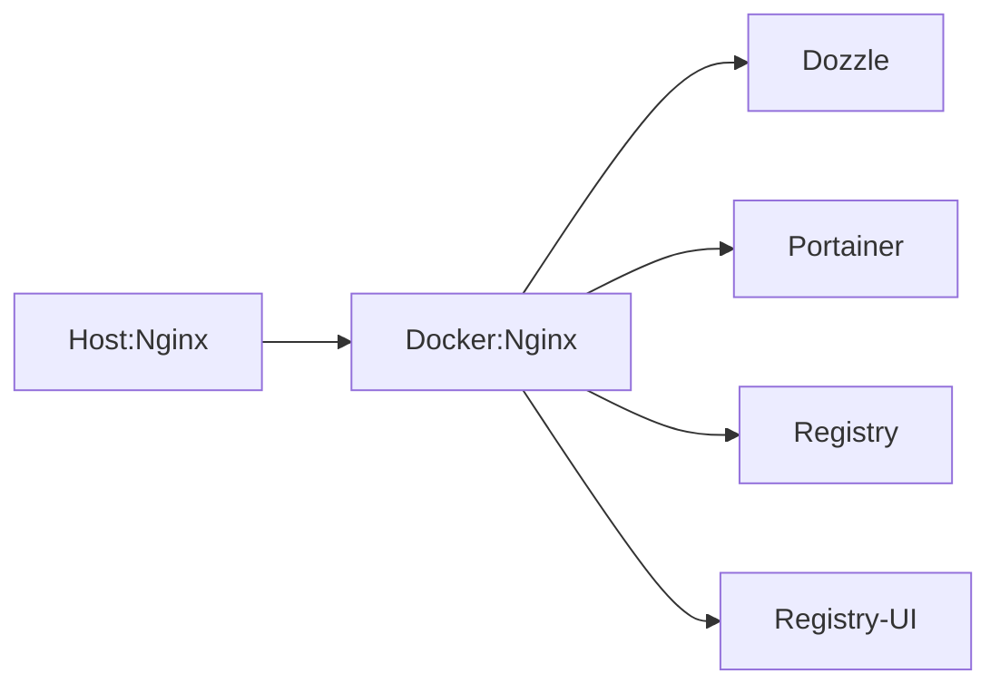

#### Docker-portal
------

**Scheme**


**Go to service directory**
```
cd docker
```

**Startup docker containers**
```
docker compose up -d
```

**Host-machine Nginx conf**
```
    server_name registry.domain.ru;

    proxy_buffering off;
    proxy_cache off;
    proxy_http_version 1.1;
    client_max_body_size 0;

    merge_slashes off;
    rewrite (.*)//+(.*) $1/$2 permanent;

    location / {
        proxy_pass http://172.16.8.1:81/;
        proxy_set_header Host $host;
        proxy_set_header X-Real-IP $remote_addr;
        proxy_set_header X-Forwarded-For $proxy_add_x_forwarded_for;
        proxy_set_header X-Forwarded-Proto $scheme;
    }
```


**Install SSL certificate**
sudo apt install python3.11-venv -y

mkdir -p /srv/certbot
cd /srv/certbot
python3 -m venv venv
/venv/bin/pip install certbot-nginx
/venv/bin/certbot --nginx


**Push images to registry**
docker tag myimage:3.2 registry.domain.ru/myimage:3.2
docker tag myimage:3.2 registry.domain.ru/myimage:latest
docker push registry.domain.ru/myimage:3.2
docker push registry.domain.ru/myimage:latest

curl https://registry.domain.ru/v2/_catalog
{"repositories":["dozzle","nginx","myimage","portainer","registry","registry-ui"]}

curl https://registry.domain.ru/v2/nginx/tags/list
{"name":"myimage","tags":["3.2","latest"]}


**View docker stack services**
```
https://registry.domain.ru/registry
https://registry.domain.ru/dozzle
https://registry.domain.ru/portainer
```

**Output**
```
$ docker compose ps
 
 Name                Command                  State                          Ports                   
-----------------------------------------------------------------------------------------------------
dozzle         /dozzle --base /dozzle           Up      10.1.2.1:8003->8080/tcp
nginx          /docker-entrypoint.sh ngin ...   Up      0.0.0.0:81->80/tcp
portainer      /portainer --http-enabled        Up      8000/tcp, 10.1.2.1:8002->9000/tcp, 9443/tcp
registry-srv   /entrypoint.sh /etc/distri ...   Up      10.1.2.1:8000->5000/tcp
registry-web   /docker-entrypoint.sh ngin ...   Up      10.1.2.1:8001->80/tcp
```
